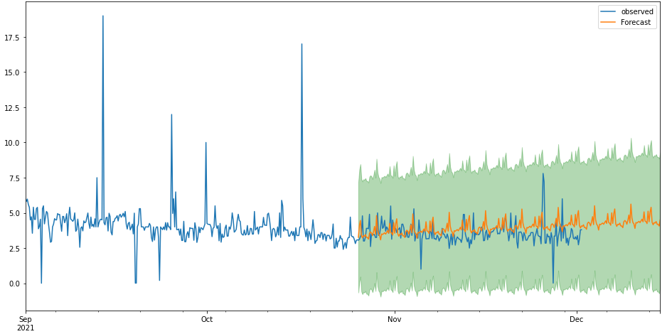

# NFTTime - The NFT Sale Price Predictor

A time series modeling tool to help you begin trading NFTs.

Author: Samantha Nasti

## Overview

NFTs, short for “non-fungible tokens”, are one of the hottest trending tradable commodities in the cryptocurrency space to date. To summarize, an NFT is a piece of digital artwork that exists on the blockchain. The [blockchain](https://www.investopedia.com/terms/b/blockchain.asp) is a distributed database that tracks the transaction history of a digital asset and makes the history of that asset unalterable – technology which is currently disrupting the payments industry. The purchase of an NFT provides the buyer with verifiable ownership of the NFT purchased, and oftentimes access to additional benefits such as intellectual property rights and community perks. 

A single NFT typically belongs to a bigger collection by a particular artist or brand in the NFT ecosystem. Examples of popular NFT collections are Bored Ape Yacht Club and Cryptopunks, each containing 10,000 similarly-branded art tokens with unique individual properties. These collections have become so sought after that they have inspired the concept of NFT digital social club exclusivity, with each collection boasting A-list celebrity token owners and multi-million dollar ticket prices. 
Anyone can create an NFT, which has inspired and empowered thousands of artists to create collections 
and sell their art on Opensea, the first and largest NFT marketplace that just [crossed a 10 billion dollar sales volume](https://beincrypto.com/opensea-crosses-10-billion-in-all-time-sales-volumes/) in 2021. 

Additionally, contemporary art investments, with an annual return of 14%, have [outperformed the S&P 500](https://www.cnbc.com/2021/05/27/there-are-unique-opportunities-in-art-says-one-asset-manager.html) (9.5% annual return) over the last 25 years , according to the Citi Global Art Market chart. 
Considering the continuously surging volume of NFT sales, plus the history of average returns in contemporary art trading, there exists an incredible opportunity to diversify one’s portfolio and make generous returns in the highly liquid digital art space. 
    
#### Risks:
   - Industry is new and uncertain: "long term hold" investment strategy is higher risk than short term gains
   - Asset can be traded 24/7 - gap risk is intense ATM especially as space continues to develop "hype"
    
#### Purpose of this Model:
   - Capture prices for NFT "flipping" (swing trading)
   - Help NFT traders forecast what their NFT purchase might look like a week or two later to provide a baseline to assess the approximate risk in this highly volatile space

## Data

Opensea Events API: https://docs.opensea.io/reference/retrieving-asset-events

This model allows you to select an NFT collection of your choice on Opensea and generate a forecast of future sales price (in Ethereum).

I used the Opensea API to create a dataset for several different NFT collections (Cool Cats, Gutter Cat Gang, and Pudgy Penguins) to explore, test, and compare time series model performance on.

I collected a minimum of 10,000 observations of sales transactions for each collection. I only selected collections that were found in Opensea's Top NFTs (By Volume) stats list, since our goal is to sell for a profit within a short time frame.

### Data Preparation

I used the Opensea API's "Events" collection to pull collection-specific sales transactions for various different NFTs. I then wrote functions to convert the dataframe index to a datetime index, and then another function to clean the dataset for easier EDA and engineer our target variable to be a readable Ethereum sale price. 

Data collection, preparation, engineering and modeling was performed on 3 different NFT collections to compare modeling results. For a detailed walkthrough from start to finish of the data preparation and modeling process, please see the primary [NFTTIME Project Notebook](https://github.com/samanthanas/NFTTime/blob/main/nft_price_predictions.ipynb). Other iterations of the modeling process, including testing on other collections, can be found [here](https://github.com/samanthanas/NFTTime/tree/main/notebooks) in the project repository notebooks folder.  

## Modeling

For each collection I run an auto-arima grid search to find the best parameters. We created a function to store the optimal parameters from the gridsearch, and another function that inputs our gridsearch variables into our model ready to make predictions.

## Results

Our model's forecasting performance on unseen data can be visualized below:

Our final model has a RMSE of 0.93, compared to our baseline model RMSE score of 2.48.

Our forecast, though improvable, is looking promising. We can use this forecast to make assisted NFT purchasing decisions. The model results allows us to assess today's purchase price of our NFT asset of interest, and then forecast the valuation of that NFT asset in the future.

Let's demonstrate this concept in action. At the time of writing, on 12/2/2021, the Gutter Cat Gang floor is: 3.98 ETH. According to our model's forecast, the minimum valuation at the floor of Gutter Cat Gang is predicted to be worth more Ethereum than today's current floor price, at roughly 4.3 ETH. Based on these findings, we would recommend purchasing this asset for a profitable NFT swing trade.

## Conclusion

## Repository Navigation

├── README.md                                     <- High-level overview of this project  
├── nft_price_predictions.ipynb                   <- Detailed primary project notebook 
├── notebooks 
├   ├── NFT_EDA_1.ipynb                           <- Collection of data and exploratory data analysis in Jupyter notebook 
├   ├── FSM_1.ipynb                               <- Modeling analysis in Jupyter notebook 
├   ├── Model_Tests.ipynb                         <- Additional collection model testing in Jupyter notebook 
├── presentation.pdf                              <- PDF version of project presentation slides 
├── environment.yml                               <- Reproducibility yml file 
├── data                                          <- Folder containing project data collected and stored in CSVs 
└── images                                        <- Folder containing the images used in project notebooks
